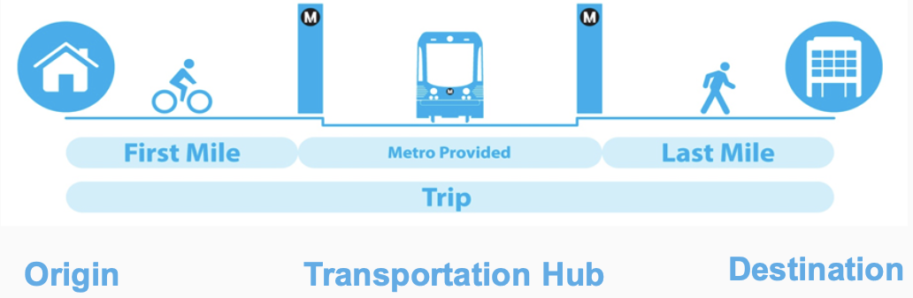

# First & Last Mile
A Popular Origin & Destination Detection Platform

This project is designed and completed by Dan Zhao, a Fellow of the Insight Data Engineering program(Silicon Valley, 2020A).

Demo slides: [Link](https://docs.google.com/presentation/d/1gMlslmQWmz4trn8RqsnwAkjDfQUjU7dEbmC6RHoGTdc/edit#slide=id.g7d745c5dc7_4_0)

UI: [Link](http://fasterprocessor.me/) 
(TO BE FINISHED)

## Overview
What is the "First & Last Mile"? 

Relying on public transport systems to travel from one location to the next usually requires the commuter to walk a considerable distance to and from each of the transit stations en route. The difficulty of getting people from starting points to transportation hubs are commonly referred to as "First Mile" problem. Similarly, "Last Mile" problem is about getting pople from transportation hubs to their final destinations.

For people who use public transportation, when they get off the subway or bus, how can they get to their final destinations if it's too far for walking? Maybe by taxi or bike. Knowing this pattern will help public transit agencies to plan better bus routes accordingly. Sharing bike and scooter companies will also be able to allocate resouces more efficiently, especially during rush hours.

First&LastMile is designed to detect the most popular destinations from/to each transportation hub at different times of the day by analyzing the taxi and bike sharing data.