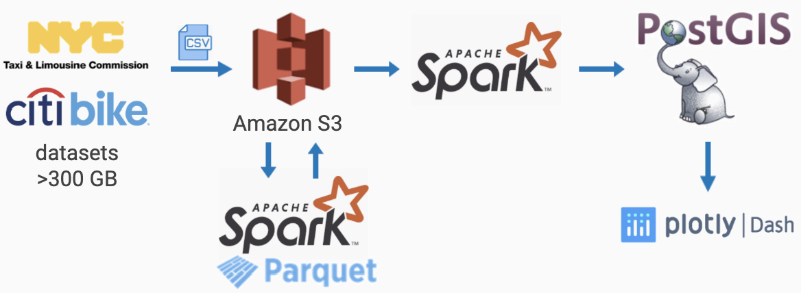

# First & Last Mile
A Plarform for Popular Origin & Destination Detection

[Demo slides](https://docs.google.com/presentation/d/1gMlslmQWmz4trn8RqsnwAkjDfQUjU7dEbmC6RHoGTdc/edit#slide=id.g7d745c5dc7_4_0) | [UI](http://fasterprocessor.me/) (TO BE FINISHED)

This project is designed and completed by Dan Zhao, a Fellow of the Insight Data Engineering program(Silicon Valley, 2020A).

## Overview
What is the "First & Last Mile"? 

Relying on public transport systems to travel from one location to the next usually requires the commuter to walk a considerable distance to and from each of the transit stations en route. The difficulty of getting people from starting points to transportation hubs are commonly referred to as "First Mile" problem. Similarly, "Last Mile" problem is about getting pople from transportation hubs to their final destinations.

For people who use public transportation, when they get off the subway or bus, how can they get to their final destinations if it's too far for walking? Maybe by taxi or bike. Knowing this pattern will help public transit agencies to plan better bus routes accordingly. Sharing bike and scooter companies will also be able to allocate resouces more efficiently, especially during rush hours.

First&LastMile is designed to detect the most popular destinations from/to each transportation hub at different times of the day by analyzing the taxi and bike sharing data.

## Data
1. New York Yellow and Green Taxi Trip Records([Link](https://www1.nyc.gov/site/tlc/about/tlc-trip-record-data.page)):  
Green taxi: 10GB, 2013.08-2019.06  
Yellow taxi: 230GB, 2009.01-2019.06  
Fields includes:  
VendorID, pick-up and drop-off dates/times, pick-up and drop-off locations, trip distances, itemized fares, rate types, payment types, driver-reported passenger counts

2. New York Citi Bike Trip Data([Link](https://www.citibikenyc.com/system-data)):  
20GB 2013.06-2019.12  
Fields includes:  
Trip Duration (seconds), Start Time and Date, Stop Time and Date, Start Station Name, End Station Name, Station ID, Station Lat/Long, Bike ID, User Type, Gender, Year of Birth

## Pipeline
The raw data of New York taxi and citi bike data are downloaded and stored to s3. Geocoding work is done by Python. The raw data is preprocessed by Spark and stored back to s3 in Parquet format to save storage and improve performance. Then the data is ingested and processed by Spark. The aggregated results are stored in PostGIS, which has some convenient geo functions. Finally, Flask is used to build a information query UI.

## Engineering Challenges
### 1. Inconsistent Schema
*Problem:*  
1. Trip files uploaded monthly with different schema
2. Some have LocationID as location information while others have longitude & latitude.

*Solution:*  
1. Define a schema for ingesting
2. Broadcast join with LocationID lookup table by converting LocationID to longitude & latitude
3. Select needed columns and store back to s3 in parquet format

### 2. Reverse Geocoding
*Problem:* 
1. Taxi LocationID information in shapefiles
2. Missing subway station longitude and latitude

*Solution:*  
1. Generate LocationID look up table by reverse geocoding the neighborhood polygons from shapefiles with Python
2. Generate subway station look up table by averaging the longitude and latitude of entrances

### 3. Aggregating Points
*Problem:*  
1. Points with slightly different latitude and longitude belong to the same destination
2. Too many points for UI to show on the map

*Possible Solutions:*  
1. round the longitude and latitude (Irregular shape -- not chosen)
2. use taxi location id (Too big area -- not chosen)
3. use K-means algorithm to aggregate locations to 100 blocks(for example) (High latency -- not choosen)
4. GeoHash (chosen!)

